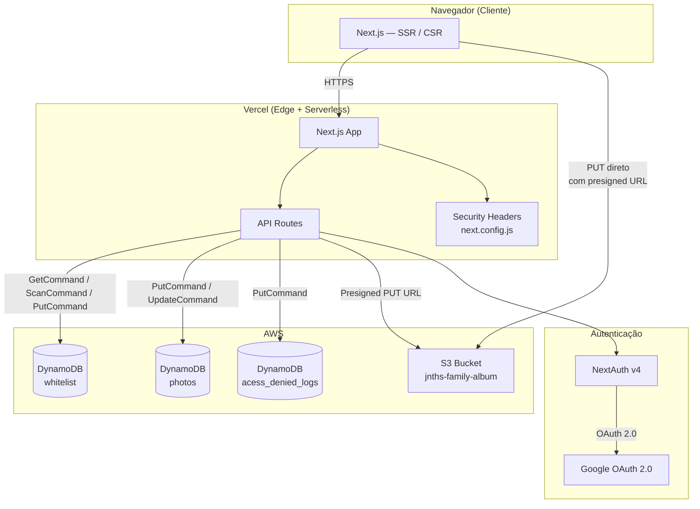
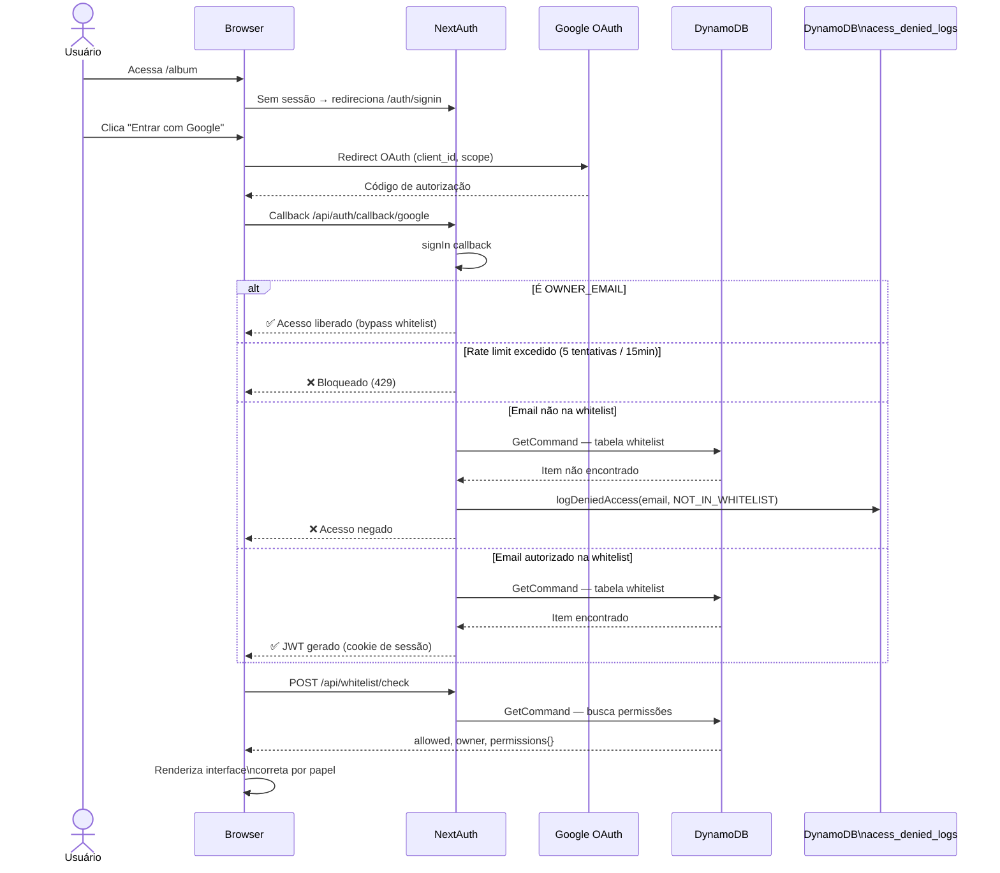
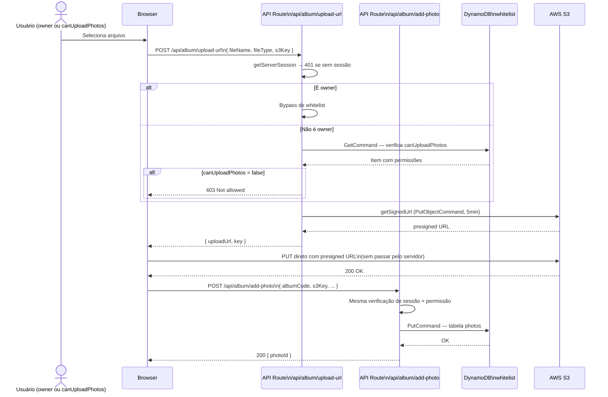
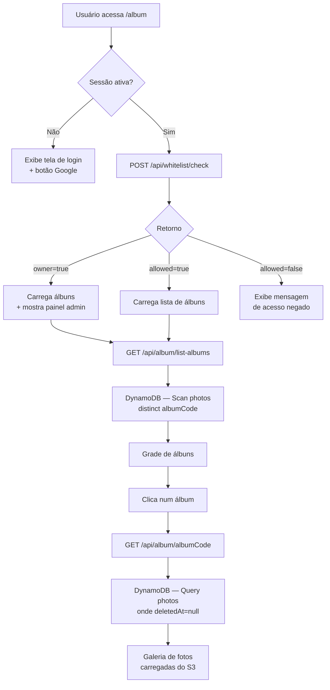
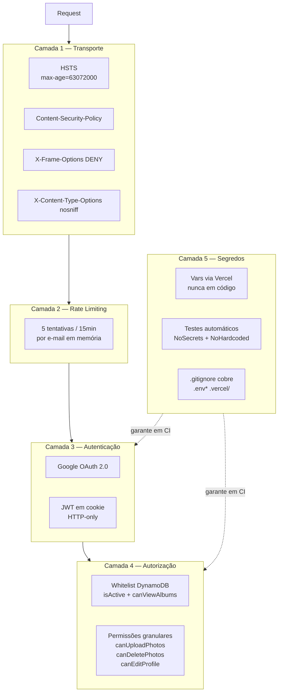
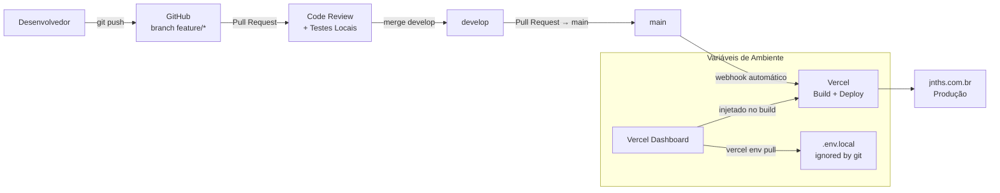
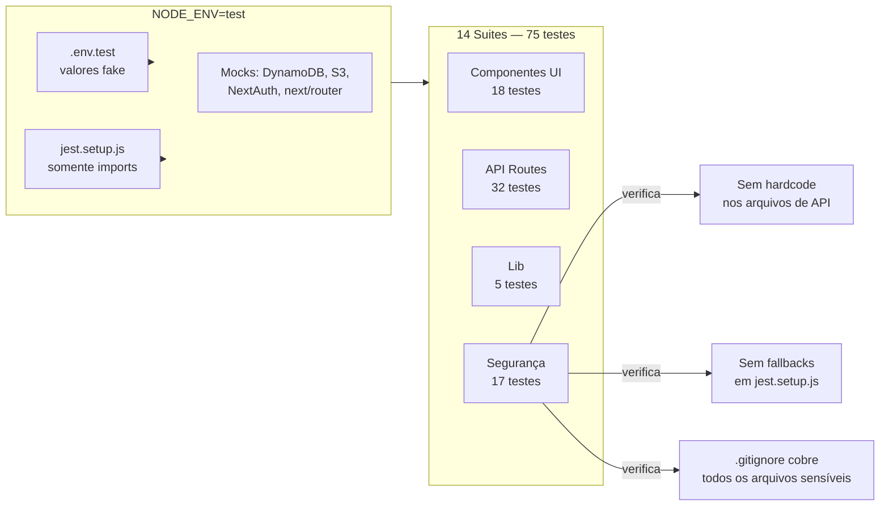

# Arquitetura do firstproject

Documento de referência técnica cobrindo a arquitetura completa: desde os requisitos funcionais até o ambiente de produção pós-deploy.

---

## 1. Visão Geral do Sistema



---

## 2. Estrutura de Pastas

```
firstproject/
├── components/
│   ├── common/         → Header, Footer
│   └── sections/       → HeroSection, AboutSection, SkillSection,
│                          StatsSection, ProjectsSection, AlbumSection
├── lib/
│   ├── dynamo.js       → DynamoDBDocumentClient (singleton)
│   ├── photos.js       → listPhotosByAlbum (paginação + soft delete)
│   ├── authLogs.js     → logDeniedAccess → DynamoDB
│   └── logger.js       → logger estruturado + maskEmail
├── pages/
│   ├── index.js        → Portfólio público
│   ├── album/
│   │   ├── index.js    → Lista de álbuns (privado)
│   │   └── [albumCode].js → Galeria de fotos do álbum
│   ├── auth/
│   │   ├── signin.js   → Página customizada de login
│   │   └── error.js    → Página de erro de autenticação
│   └── api/
│       ├── auth/
│       │   ├── [...nextauth].js → Configuração NextAuth
│       │   └── rate-limit.js    → Rate limit em memória
│       ├── album/
│       │   ├── upload-url.js    → Gera presigned URL no S3
│       │   ├── add-photo.js     → Salva metadados no DynamoDB
│       │   ├── delete.js        → Soft delete no DynamoDB
│       │   ├── list-albums.js   → Lista álbuns distintos
│       │   ├── list.js          → Lista fotos por prefixo S3 (legado)
│       │   └── [albumCode].js   → Lista fotos de um álbum via DynamoDB
│       └── whitelist/
│           ├── check.js   → Verifica acesso + retorna permissões
│           ├── list.js    → Lista todos os usuários (paginado)
│           ├── add.js     → Adiciona usuário
│           ├── update.js  → Atualiza permissões
│           └── remove.js  → Remove usuário
├── tests/
│   ├── api/            → Testes das API Routes
│   ├── lib/            → Testes das funções de lib
│   ├── security/       → NoSecrets, NoHardcoded
│   └── *.test.js       → Testes de componentes UI
└── docs/               → Documentação técnica
```

---

## 3. Fluxo de Autenticação



---

## 4. Fluxo de Upload de Foto



---

## 5. Fluxo de Acesso à Galeria



---

## 6. Modelo de Dados (DynamoDB)

```mermaid
erDiagram
    WHITELIST {
        string email PK
        string name
        boolean isActive
        boolean canViewAlbums
        boolean canUploadPhotos
        boolean canDeletePhotos
        boolean canEditProfile
        string lastLoginAt
    }

    PHOTOS {
        string photoId PK
        string albumCode
        string s3Key
        string uploadedAt
        string uploadedBy
        string deletedAt
    }

    ACESS_DENIED_LOGS {
        string email PK
        string timestamp SK
        string reason
    }

    WHITELIST ||--o{ PHOTOS : "usuário faz upload"
    WHITELIST ||--o{ ACESS_DENIED_LOGS : "tentativa negada"
```

---

## 7. Camadas de Segurança



---

## 8. Pipeline de Deploy



---

## 9. Ambiente de Testes



---

## 10. Variáveis de Ambiente

| Variável | Usado em | Descrição |
|---|---|---|
| `AWS_REGION` | `lib/dynamo.js`, `upload-url.js` | Região AWS (sa-east-1) |
| `AWS_ACCESS_KEY_ID` | `upload-url.js` | Credencial IAM para S3 |
| `AWS_SECRET_ACCESS_KEY` | `upload-url.js` | Credencial IAM para S3 |
| `AWS_S3_BUCKET` | `upload-url.js` | Nome do bucket S3 |
| `DYNAMO_TABLE_WHITELIST` | APIs de album, whitelist | Tabela de controle de acesso |
| `DYNAMO_TABLE_PHOTOS` | `add-photo.js`, `delete.js`, `[albumCode].js` | Tabela de metadados de fotos |
| `DYNAMO_TABLE_AUTH_DENIED` | `lib/authLogs.js` | Tabela de logs de acesso negado |
| `OWNER_EMAIL` | NextAuth, todas as APIs protegidas | E-mail do dono (bypass total) |
| `GOOGLE_CLIENT_ID` | NextAuth | App Google OAuth |
| `GOOGLE_CLIENT_SECRET` | NextAuth | App Google OAuth |
| `NEXTAUTH_SECRET` | NextAuth | Assina JWT de sessão |
| `NEXTAUTH_URL` | NextAuth | URL base (https://jnths.com.br) |

Todas gerenciadas pela Vercel. Localmente obtidas via `vercel env pull .env.local`.
